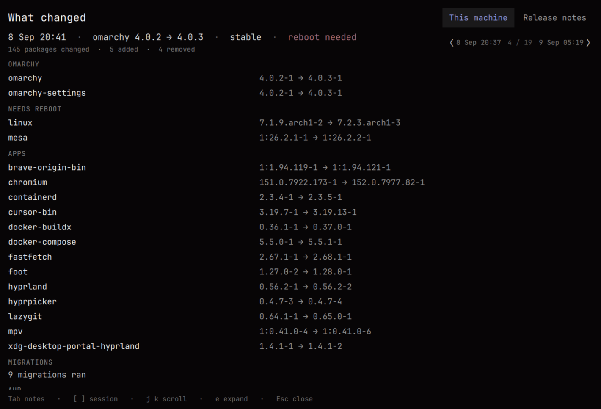
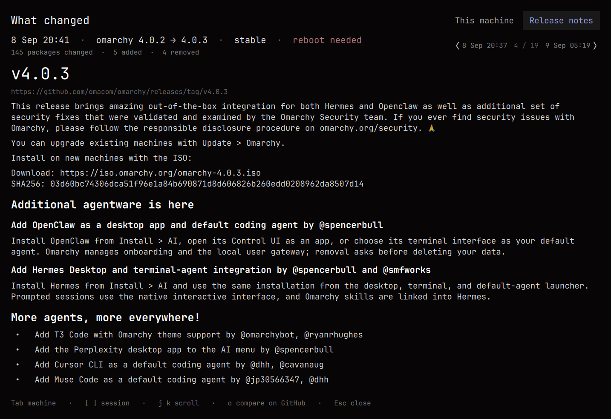

# What Changed

**What actually landed on this machine? What is new in Omarchy?**

Two questions after every Omarchy update, answered for the version jump you
actually took. Not a pending-update indicator. Not a news feed.



---

## The problem

`omarchy update` is a black box once it finishes.

One run upgrades Omarchy *and* the rest of the system — kernel, Chromium, AUR
packages, migrations — and then `/tmp/omarchy-update.log` is gone after a reboot.
The stock bar icon only ever meant "the `omarchy` package is behind". GitHub's
release notes describe the product, not your computer. And "the latest update"
is ambiguous: last night's 4.0.2 → 4.0.3 and this morning's keyring reinstall
are both "the latest".

So the two questions at the top do not have the same answer, and once the update
is finished, nothing on the system answers either of them. This is the reading
surface for both, scoped to one update run. Several Omarchy plugins will tell
you what an update *is about to* change; this is the one for afterwards.

## The two views

### This machine

Every package, migration and reboot flag from one update session, grouped so a
145-package night is legible. Omarchy's own version move first, then anything
that wants a reboot, then named applications, then the long tail collapsed
behind a count.

### Release notes

The official Omarchy notes for **the exact version jump that session made** —
not "latest on GitHub" — parsed into headings, bullets and paragraphs rather
than dumped as raw Markdown.



---

## Install

```bash
omarchy plugin add https://github.com/BVisagie/omarchy-what-changed.git --enable
```

Then add a menu entry so it lives under **Update › What changed**. Merge this
into `~/.config/omarchy/extensions/omarchy-menu.jsonc` — create the file if it
does not exist. The dotted id files it under the existing Update submenu on its
own, with no parent declaration:

```jsonc
{
  "update.what-changed": {
    "icon": "󰌱",
    "label": "What changed",
    "action": "omarchy-shell shell summon io.github.bvisagie.what-changed"
  }
}
```

That is the whole install. There is no hook to register and no daemon. Your
update history is already there the first time you open it — the plugin
reconstructs it from `/var/log/pacman.log`, so a fresh install typically has
months of sessions in it immediately.

You can also summon it directly, optionally at a specific session or view:

```bash
omarchy-shell shell summon io.github.bvisagie.what-changed
omarchy-shell shell summon io.github.bvisagie.what-changed \
  '{"session":"20260908T184129Z","tab":"notes"}'
```

## The bar icon

What Changed puts one icon in the bar, and it is **not** an update indicator.

It appears only when an update has landed that you have not read yet, and it
disappears the moment you open the overlay. It carries no badge and no count. It
never tells you updates are available — that is `omarchy.system-update`'s job,
and this plugin does not duplicate, clone or replace it.

Nothing polls. Two events can change the answer and both are handled directly:

- A **new session** can only be created by `omarchy update`, which always ends by
  restarting the shell — so the widget is rebuilt right after the only event
  that matters.
- The **read marker** is watched with a `FileView`, so the icon clears the
  instant you open the overlay.

Prefer it out of the bar? The plugin stays fully usable from the menu:

```bash
omarchy plugin disable io.github.bvisagie.what-changed
```

The one case the shell restart does not cover is an update run over ssh or a TTY,
where `omarchy-restart-shell` could not run. Force a re-check with:

```bash
omarchy-shell -q io.github.bvisagie.what-changed refresh
```

## Keys

| Key | Action |
|---|---|
| `Tab` | Switch This machine / Release notes |
| `[` `]` | Older / newer session |
| `j` `k`, arrows, `PgUp` `PgDn`, `Home` `End` | Scroll |
| `e` | Expand the collapsed "other packages" group |
| `o` | Open the GitHub compare for this jump |
| `Esc` `q` | Close |

There is deliberately no key that starts an update.

---

## The CLI

The overlay only ever runs `bin/what-changed` and renders its JSON. It stands
alone in a terminal:

```console
$ what-changed sessions
9 Sep 10:27  4.0.3             1↻
9 Sep 05:19  4.0.3             1↑ 1↻
8 Sep 20:41  4.0.2 → 4.0.3     135↑ 5+ 4- 1↻         reboot

$ what-changed show 20260908T184129Z
8 Sep 20:41  ·  omarchy 4.0.2 → 4.0.3  ·  stable  ·  reboot needed
145 packages changed  ·  5 added  ·  4 removed

Omarchy
  omarchy           4.0.2-1 → 4.0.3-1
  omarchy-settings  4.0.2-1 → 4.0.3-1

Needs reboot
  linux  7.1.9.arch1-2 → 7.2.3.arch1-3
  mesa   1:26.2.1-1 → 1:26.2.2-1

Migrations
  9 migrations ran
…
```

| Command | Does |
|---|---|
| `what-changed sessions` | One line per session, newest first |
| `what-changed show [id]` | What landed (the default command) |
| `what-changed notes [id]` | Release notes for that session's jump |
| `what-changed compare-url [id]` | The GitHub compare URL for the jump |
| `what-changed status` | The newest session, and whether it has been read |
| `what-changed mark-read [id]` | Record a session as read (default: the newest) |

| Flag | Does |
|---|---|
| `--json` | Machine-readable. `show --json` arrives already grouped |
| `--expand other` | Include the collapsed group's rows |
| `--version` | Reads the version from `manifest.json` |

A session id may be given in full (`20260908T184129Z`) or as a prefix. Where a
prefix matches more than one session, the newest match wins.

---

## How a session is found

This is the part worth understanding, because it is what lets the plugin work
with no hook and no capture step.

Every `omarchy update` begins by running
`pacman -Sy --noconfirm archlinux-keyring` (from `omarchy-update-keyring`), and
that lands in `/var/log/pacman.log`. **That line is the head of a session.**
Everything until the next one belongs to it, however many pacman transactions it
took — the keyring, the `-Syu`, one `-U` per AUR package, the orphan sweep.

Within that window, only the pacman invocations an update actually makes are
counted:

| Invocation | Part of the update? |
|---|---|
| `pacman -Sy --noconfirm archlinux-keyring` | yes — `omarchy-update-keyring` |
| `pacman -Syu … --overwrite /usr/share/omarchy/*` | yes — `omarchy-update-system-pkgs` |
| `pacman -U … --config /etc/pacman.conf … /.cache/yay/…` | yes — yay, tagged as AUR |
| `pacman -Rns …` **without** `--noconfirm` | yes — `omarchy-update-orphan-pkgs` |
| `pacman -S --noconfirm --needed …` | no — `omarchy pkg add` |
| `pacman -Rns --noconfirm …` | no — `omarchy pkg remove` |

That last distinction is the whole trick: Omarchy's orphan sweep runs
`sudo pacman -Rns "${orphans[@]}"` with no `--noconfirm`, while `omarchy pkg
remove` always passes it. So the `gthumb` you installed an hour after the update
does not get attributed to it.

### Why not a post-update hook

Because a hook **structurally cannot see the whole update**.
`/usr/share/omarchy/bin/omarchy-update` calls `omarchy-hook post-update` *before*
`omarchy-update-aur-pkgs`, `omarchy-update-mise`, `omarchy-update-orphan-pkgs`
and `omarchy-update-restart`. A hook-written record's AUR list is empty by
construction. Reading the log afterwards is the only approach that sees
everything — and it works retroactively, which is why a fresh install already
has your history in it.

### What is derived, and how honestly

| Field | Source |
|---|---|
| Packages, versions, AUR provenance | `/var/log/pacman.log`, exactly |
| Omarchy version | The `omarchy` package event in that session. Sessions that did not move it carry the previous version forward; sessions older than the first recorded jump show none rather than guessing |
| Migrations | `~/.local/state/omarchy/migrations/*.sh` mtimes falling inside the session window |
| Reboot needed | A kernel-class package in that session. The live `reboot-required` marker is only trusted for the newest session, because `omarchy-update-restart` clears it |
| Channel | `omarchy-channel-current`, which reports *now*, not then |
| `mise` | Not recorded per-session anywhere, so not claimed |
| Repo | Not in `pacman.log`, and `pacman -Si` needs a sync, so not claimed |

`counts.aur` and the AUR group answer different questions. The count is
provenance — how many packages in that session came from the AUR — while the
group lists only the AUR packages not already shown under Apps or Omarchy. A
session that upgraded `brave-origin-bin` and `ai-usagebar-bin` reports
`counts.aur: 2` and shows one row under AUR, because Brave is a named app.

---

## What it writes

Two paths, both removable, and nothing else anywhere:

| Path | What |
|---|---|
| `~/.local/state/io.github.bvisagie.what-changed/last-read` | One line naming the newest session you have opened. This is what makes the bar icon appear and disappear |
| `~/.cache/io.github.bvisagie.what-changed/releases/` | Fetched release notes. Tags are immutable, so these are cached forever and fetched once each |

It never writes to your Omarchy config, never touches `/var/log/pacman.log`, and
never needs sudo.

## Removal

```bash
omarchy plugin remove io.github.bvisagie.what-changed
rm -rf ~/.local/state/io.github.bvisagie.what-changed \
       ~/.cache/io.github.bvisagie.what-changed
```

Then delete the `update.what-changed` entry from
`~/.config/omarchy/extensions/omarchy-menu.jsonc` if you added it.

`omarchy plugin remove` takes the plugin out of the bar and the menu, but it does
not clear XDG state or cache, which is why the second command is listed.

## Requirements

Omarchy 4.x. Uses only `bash`, `jq`, `awk`, `curl` and coreutils — `jq` is
already a hard dependency of the `omarchy` package and the rest ship with base.
No Python, no Node at runtime.

---

# Working on this

Everything below is for contributors and coding agents.

## Design rules

These are invariants, not v1 scope limits. **Changing any of them changes what
the plugin is**, so treat them as requirements rather than preferences.

1. **Never signals pending updates.** `omarchy.system-update` owns that. No
   badge, no count, no number on the widget — a single glyph or nothing.
2. **Never runs an update.** Read-only, no sudo, no pacman lock, no key that
   starts one.
3. **Not a poller.** No timers. Every refresh is driven by a file changing or
   the shell restarting.
4. **QML renders, the CLI knows.** No pacman, git or network calls from QML.
   Every `Process` command is a fixed argv array — never a shell string.
5. **Honest over clever.** `unknown` beats a wrong checkmark. Anything derived
   rather than observed is labelled as derived.
6. **Untrusted input.** Package names come from a log and release bodies from
   GitHub. Everything is `Text.PlainText`; intake rebuilds objects from known
   fields only; every string is control-character flattened and length-capped.

## Out of scope

Not a backlog — these are things the plugin declines to do, and a change that
adds one is a change to what it is:

- **Anything about pending updates**: scanning for them, listing them, an apply
  button, or a badge. That is `omarchy.system-update`'s job.
- **Arch news, `.pacnew` handling, snapper diffs, AI summaries.** Other plugins
  cover these and cover them better.
- **`mise` results.** No available source records them per session, so claiming
  them would mean guessing.

Per-bullet `landed` / `not installed` / `n/a here` annotations on release notes
are wanted, but only once they can be right: a wrong checkmark is worse than an
honest `unknown`.

## Repo map

| File | Role |
|---|---|
| `bin/what-changed` | The whole read model. bash + jq + awk. Parses the log, groups, fetches notes, owns the read marker |
| `Model.js` | Intake and formatting for QML. Sanitises CLI output, parses Markdown into blocks, formats headers and counts |
| `Overlay.qml` | The summoned surface: tab state, keys, `Process` wiring, session navigation |
| `SessionHeader.qml` | The header line and the prev/next stepper |
| `MachineView.qml` | Grouped package list. Renders what the CLI bucketed; decides nothing itself |
| `NotesView.qml` | Release-note blocks |
| `BarWidget.qml` | The unread marker |
| `manifest.json` | Plugin manifest. Also the single source of truth for the version |
| `test/sessions.test.sh` | CLI tests against a fixture log. No network |
| `test/model.test.js` | Intake, sanitising and formatting tests |
| `test/fixtures/pacman.log` | A synthetic log: one full update, one thin one, plus manual pacman calls that must **not** be attributed |

## Architecture

```
/var/log/pacman.log ───────────────────────┐
~/.local/state/omarchy/migrations/ ────────┤
~/.local/state/omarchy/reboot-required ────┤
                                           ├──→ bin/what-changed ──→ JSON
~/.cache/…/releases/  (GitHub, cached) ────┤                          │
~/.local/state/…/last-read ────────────────┘                          │
                                                                      ▼
                        Overlay.qml / BarWidget.qml  ──→  Model.js  ──→  views
```

The CLI is the seam. If Omarchy ever grows a first-party `omarchy update log`,
this plugin becomes a viewer over it by changing one layer.

## Data contracts

QML never inspects the system; it consumes these. Anything added here must also
be added to the matching `intake*` function in `Model.js`, or it will be dropped
on purpose.

<details>
<summary><code>what-changed sessions --json</code></summary>

```json
{
  "schemaVersion": 1,
  "sessions": [
    {
      "id": "20260908T184129Z",
      "startedAt": "2026-09-08T20:41:29+0200",
      "finishedAt": "2026-09-08T20:47:11+0200",
      "label": "8 Sep 20:41",
      "channel": "stable",
      "incomplete": false,
      "source": "pacman-log",
      "isLatest": false,
      "omarchy": {
        "package": "omarchy",
        "from": "4.0.2-1",
        "to": "4.0.3-1",
        "jumped": true,
        "jump": "4.0.2-1 → 4.0.3-1"
      },
      "rebootRequired": true,
      "rebootReason": ["mesa", "linux"],
      "migrations": ["1788577553"],
      "counts": {
        "upgraded": 135, "installed": 5, "removed": 4, "downgraded": 0,
        "reinstalled": 1, "aur": 2, "total": 145, "omitted": 0
      }
    }
  ]
}
```

Ids are the session start in UTC (`YYYYMMDDTHHMMSSZ`); `label` is local time for
display. `incomplete` means a pacman transaction in that window started without
completing.
</details>

<details>
<summary><code>what-changed show --json</code></summary>

Group order is fixed and meaningful: `omarchy`, `reboot`, `apps`, `migrations`,
`aur`, `other`. A group with a `summary` states itself in one line instead of
listing rows. `other` is collapsed and carries `count` with no `items` until
`--expand other`.

```json
{
  "schemaVersion": 1,
  "session": { "…as above, minus events…" },
  "groups": [
    { "id": "omarchy", "title": "Omarchy",
      "items": [
        { "kind": "pkg", "op": "upgraded", "name": "omarchy",
          "from": "4.0.2-1", "to": "4.0.3-1", "aur": false }
      ] },
    { "id": "migrations", "title": "Migrations",
      "summary": "9 migrations ran",
      "items": [ { "kind": "migration", "name": "1788577553" } ] },
    { "id": "other", "title": "127 other packages",
      "collapsed": true, "count": 127, "items": [] }
  ]
}
```

`op` is one of `upgraded`, `installed`, `removed`, `downgraded`, `reinstalled`.
`outputTruncated: true` appears at the top level when the expanded view would
have exceeded the output cap.
</details>

<details>
<summary><code>what-changed status --json</code> and <code>notes --json</code></summary>

```json
{ "schemaVersion": 1, "unread": false,
  "lastRead": "20260909T082737Z",
  "newest": { "…a session, or null…" } }
```

`unread` is `newest.id !== lastRead`. An absent marker means first run: the
newest session is adopted so the bar starts quiet. An unreadable marker counts
as unread, because claiming "all read" would swallow a real one.

```json
{ "schemaVersion": 1,
  "status": "ok",
  "message": "",
  "releases": [ { "tag": "v4.0.3", "name": "v4.0.3",
                  "url": "https://github.com/omacom/omarchy/releases/tag/v4.0.3",
                  "body": "…markdown…" } ] }
```

`status` is `ok`, `partial`, `no-jump` or `unavailable`. `Model.parseNotes` adds
a `blocks` array per release — `h1`–`h3`, `p`, `li`, `code`, `quote`, `rule` —
which is what `NotesView.qml` renders.
</details>

## Omarchy integration points

Verified against Omarchy 4.0.3. If upstream changes any of these, the
corresponding behaviour is what breaks:

| Depends on | Where | Used for |
|---|---|---|
| `pacman -Sy --noconfirm archlinux-keyring` runs first | `bin/omarchy-update-keyring` | The session start marker |
| `omarchy-restart-shell` ends every update | `bin/omarchy-update-restart` | The widget refreshing without a poller |
| The orphan sweep omits `--noconfirm` | `bin/omarchy-update-orphan-pkgs` | Telling the sweep apart from `omarchy pkg remove` |
| The post-update hook fires before AUR/mise | `bin/omarchy-update` | Why there is no hook |
| Migration markers are touched as they run | `bin/omarchy-migrate` | Attributing migrations by mtime |
| The menu merges a user JSONC extension | `shell/plugins/menu/Menu.qml` | The `Update › What changed` entry |
| Third-party widgets receive `bar`, `moduleName`, `settings`, and `bar.shell` exposes `summon` | `shell/plugins/bar/Bar.qml`, `shell/Ui/PluginBarApi.qml` | The widget opening the overlay in-process |
| For a `bar-widget` plugin, "enabled" means placement in `bar.layout` | `shell/services/PluginRegistry.qml` | Why enabling needs `--section` |

## Testing

```bash
./test/sessions.test.sh      # CLI: parsing, grouping, marker, failure modes
node test/model.test.js      # intake, sanitising, Markdown blocks, formatting
omarchy plugin validate .
/usr/lib/qt6/bin/qmllint -I /usr/share/omarchy/shell *.qml
```

Neither suite touches the network — `curl` is shimmed to fail inside
`sessions.test.sh`, so an accidental fetch shows up as a failure rather than a
slow, flaky pass. Both are plain scripts: no framework, and no dependency the
plugin does not already have.

The CLI honours four environment overrides, which is what makes it testable:

| Variable | Overrides |
|---|---|
| `WHAT_CHANGED_PACMAN_LOG` | `/var/log/pacman.log` |
| `WHAT_CHANGED_STATE_DIR` | Omarchy's state dir (migrations, reboot marker) |
| `WHAT_CHANGED_STATE_HOME` | This plugin's own state dir (the read marker) |
| `WHAT_CHANGED_CACHE_DIR` | The release-note cache |

## Local development loop

The plugin runs from `~/.config/omarchy/plugins/<id>/`, so iterate by syncing and
restarting the shell:

```bash
DEST=~/.config/omarchy/plugins/io.github.bvisagie.what-changed
cp *.qml Model.js manifest.json "$DEST/" && cp bin/what-changed "$DEST/bin/"
omarchy-restart-shell

omarchy-shell shell summon io.github.bvisagie.what-changed
journalctl --user --since "1 minute ago" | grep what-changed
```

Two things that will otherwise cost an hour:

- **Quickshell caches compiled QML.** After an edit that changes a type, a plain
  rescan can keep serving the stale compile, so an error you already fixed keeps
  reappearing. `omarchy-restart-shell` is the reliable move.
- **`implicitHeight` is read-only on `Column`.** Assigning it fails the whole
  component with `Type <X> unavailable`, which reads like a missing import.

To exercise the widget without waiting for a real update:

```bash
"$DEST/bin/what-changed" mark-read 20260908T184129Z   # an older id → icon appears
"$DEST/bin/what-changed" mark-read                    # newest → icon clears
```

The icon reacts within a second; the marker `FileView` does not need a restart.

## License

MIT © [BVisagie](https://github.com/BVisagie)
