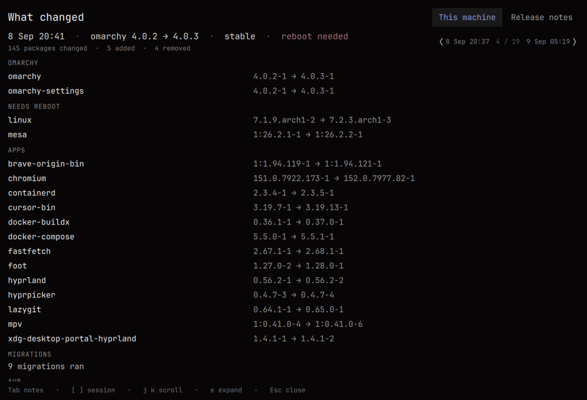
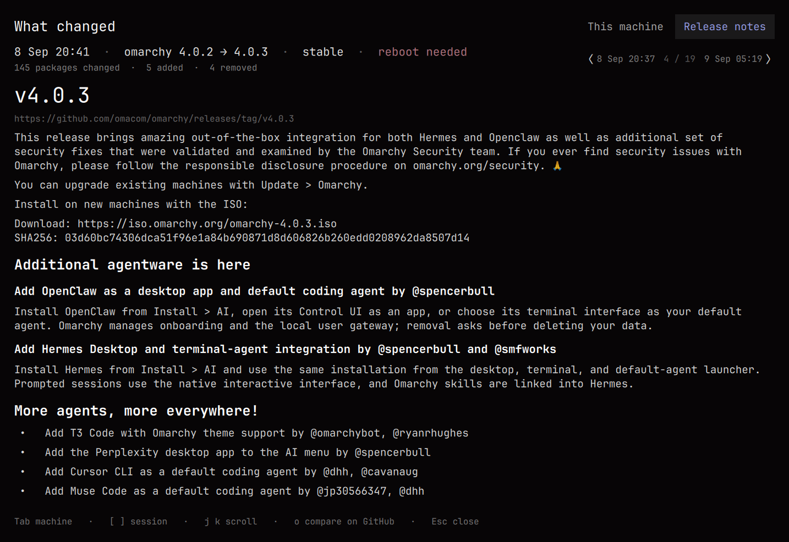

# What Changed

**What actually changed after my Omarchy update?**



---

## The problem

`omarchy update` can change Omarchy, the kernel, packages, migrations and more —
but once it finishes, that information is easy to lose.
`/tmp/omarchy-update.log` is gone after a reboot, the stock bar icon only ever
meant "the `omarchy` package is behind", and GitHub's release notes describe the
product, not your computer.

What Changed gives you a clear, per-update summary of what actually changed on
your machine, scoped to one update run. Other plugins show you what an update
*will* do; this is the one for what it actually did.

## The two views

### This machine

Every package, migration and reboot flag from one update session, grouped so a
145-package night is legible. Omarchy's own version move first, then anything
with reboot-related changes, then named applications and inferred migration
package changes, then the long tail collapsed behind a count. Other changes
during the same window are shown separately and excluded from update totals.

### Release notes

The official Omarchy notes for **the exact version jump that session made** —
not "latest on GitHub" — parsed into headings, bullets and paragraphs rather
than dumped as raw Markdown.



---

## Install

```bash
omarchy plugin add https://github.com/BVisagie/omarchy-what-changed.git --enable
```

Then add a menu entry so it lives under **Update › What changed**. Merge this
into `~/.config/omarchy/extensions/omarchy-menu.jsonc` — create the file if it
does not exist. The dotted id files it under the existing Update submenu on its
own, with no parent declaration:

```jsonc
{
  "update.what-changed": {
    "icon": "󰌱",
    "label": "What changed",
    "action": "omarchy-shell shell summon io.github.bvisagie.what-changed"
  }
}
```

That is the whole install. There is no hook to register and no daemon. Your
update history is already there the first time you open it — the plugin
reconstructs it from `/var/log/pacman.log`, so a fresh install typically has
months of sessions in it immediately.

You can also summon it directly, optionally at a specific session or view:

```bash
omarchy-shell shell summon io.github.bvisagie.what-changed
omarchy-shell shell summon io.github.bvisagie.what-changed \
  '{"session":"20260908T184129Z","tab":"notes"}'
```

## The bar icon

What Changed puts one icon in the bar, and it is **not** an update indicator.

It appears only when an update has landed that you have not read yet, and it
disappears the moment you open the overlay. It carries no badge and no count. It
never tells you updates are available — that is `omarchy.system-update`'s job,
and this plugin does not duplicate, clone or replace it.

Nothing polls. The widget checks recorded sessions when the shell starts, and
watches the read marker with a `FileView` so opening the overlay clears the icon.
Stable 4.0.4 restarts the shell at the end of a successful update. Failed updates
and updates over SSH or a TTY may need a manual re-check:

```bash
omarchy-shell -q io.github.bvisagie.what-changed refresh
```

The inspected upstream development flow restarts the shell before hooks, mise
and AUR finish. Version 1.1.0 can therefore show a partial session until a manual
refresh or another shell restart. Reading that session records its ID; later
changes to the same ID do not restore the icon in this release. Event-driven
refresh and content fingerprints are reserved for a separately reviewed release.

A current system reboot request appears in the overlay only. It never makes the
bar icon appear, even if the request came from an unrelated system action.

That handler lives on the bar widget, so it exists only while the widget is in
`bar.layout` — which is the normal installation, and the only one where there is
an icon to re-check in the first place.

### If you would rather not have the icon

Note that `omarchy plugin disable` turns off the **whole plugin**, not just the
bar entry — the menu item stops working too. Omarchy enables a plugin by writing
one entry, and for a plugin that declares `bar-widget` that entry goes into
`bar.layout`, so removing it deregisters the overlay as well.

Before reaching for that: the icon is not permanent. It occupies zero width
whenever there is nothing unread, which is nearly all of the time.

If you do want the overlay without ever seeing the icon, move the plugin's entry
in `~/.config/omarchy/shell.json` out of `bar.layout.right` and into the
top-level `plugins` array:

```jsonc
"plugins": [
  { "id": "io.github.bvisagie.what-changed" }
]
```

Then `omarchy-restart-shell`. The overlay stays summonable from the menu and the
widget is never instantiated — and with it goes both the icon and the `refresh`
handler above, which that configuration no longer has anything to refresh.

## Keys

| Key | Action |
|---|---|
| `Tab` | Switch This machine / Release notes |
| `[` `]` | Older / newer session |
| `j` `k`, arrows, `PgUp` `PgDn`, `Home` `End` | Scroll |
| `e` | Expand the collapsed "other packages" group |
| `o` | Open the GitHub compare for this jump |
| `Esc` `q` | Close |

There is deliberately no key that starts an update.

---

## The CLI

The overlay only ever runs `bin/what-changed` and renders its JSON. It stands
alone in a terminal — it is not on `PATH`, so alias it if you want it there:

```bash
alias what-changed=~/.config/omarchy/plugins/io.github.bvisagie.what-changed/bin/what-changed
```


```console
$ what-changed sessions
9 Sep 10:27  4.0.3             1↻
9 Sep 05:19  4.0.3             1↑ 1↻
8 Sep 20:41  4.0.2 → 4.0.3     135↑ 5+ 4- 1↻         reboot

$ what-changed show 20260908T184129Z
8 Sep 20:41  ·  omarchy 4.0.2 → 4.0.3  ·  current channel: stable  ·  reboot needed
145 packages changed  ·  5 added  ·  4 removed

Omarchy
  omarchy           4.0.2-1 → 4.0.3-1
  omarchy-settings  4.0.2-1 → 4.0.3-1

Reboot-related changes
  linux  7.1.9.arch1-2 → 7.2.3.arch1-3
  mesa   1:26.2.1-1 → 1:26.2.2-1

Migrations
  9 migrations ran
…
```

| Command | Does |
|---|---|
| `what-changed sessions` | One line per session, newest first |
| `what-changed show [id]` | What landed (the default command) |
| `what-changed notes [id]` | Release notes for that session's jump |
| `what-changed compare-url [id]` | The GitHub compare URL for the jump |
| `what-changed status` | The newest session, and whether it has been read |
| `what-changed mark-read [id]` | Record a session as read (default: the newest) |

| Flag | Does |
|---|---|
| `--json` | Machine-readable. `show --json` arrives already grouped |
| `--expand other` | Include the collapsed group's rows |
| `--version` | Reads the version from `manifest.json` |

A session id may be given in full (`20260908T184129Z`) or as a prefix. Where a
prefix matches more than one session, the newest match wins.

| Exit | Means |
|---|---|
| `0` | Success |
| `3` | The log holds no update sessions yet |
| `1` | A real failure: missing or unreadable log, unknown command, no such session |

`3` exists so a caller can tell "this machine has never been updated" — a true
and complete answer — from "the log did not read". The overlay uses it to avoid
reporting a permissions problem as an empty history.

---

## How a session is found

This is the part worth understanding, because it is what lets the plugin work
with no hook and no capture step.

Every `omarchy update` begins by running
`pacman -Sy --noconfirm archlinux-keyring` (from `omarchy-update-keyring`), and
that lands in `/var/log/pacman.log`. **That line is the head of a session.**
The log order splits sessions at each such invocation. Recognized update
commands are admitted within one hour of the last recognized activity; accepted
commands extend that rolling window. Matching is heuristic: a manual command
with the same shape can be indistinguishable from an update step.

| Invocation | Recognition |
|---|---|
| `pacman -Sy --noconfirm archlinux-keyring` | Session start and update-keyring |
| `pacman -S --noconfirm --needed [--] omarchy-keyring` | First-run keyring install |
| `pacman -Syu … --overwrite /usr/share/omarchy/*` | System package update |
| `pacman -U … --config /etc/pacman.conf … /.cache/yay/…` or `/.cache/paru/…`, without `--needed` | AUR update |
| `pacman -D … --config /etc/pacman.conf …` | AUR dependency marking |
| `pacman -Rns …` without `--noconfirm` | Orphan sweep |

### Migration inference and nearby changes

Other pacman transactions are candidates regardless of command form, including
pkg-add, pkg-drop, AUR installs with `--needed`, and direct replacements with
`--ask 4` or `--ask=4`. Their fixed window ends at the earlier of the next session
start and the last recognized update activity plus 1800 seconds. Candidate
activity never extends that bound or the rolling recognition window.

A completed candidate starting at or after the final completed system-upgrade
transaction and ending at or before the newest migration completion marker is
`migration-inferred`. Both ends include equal-second timestamps. Markers
establish a migration-phase bracket, not the caller of a command: concurrent
manual commands cannot be ruled out. When the system upgrade has nothing to
do and opens no transaction, its last recorded log line is the lower bound;
a migration completion marker supplies the evidence that the updater proceeded
after that step. Missing markers, an unfinished candidate, or a system
transaction that started without completing cannot establish that inference.

Inferred rows count toward the update and reboot inference. Omarchy and
reboot-related rows stay in their usual groups and carry an `(inferred)` label;
remaining rows appear under **Migration package changes (inferred)**. All other
candidates appear under **Other changes during this window** with separate
counts. They do not change primary totals, that session’s release jump or reboot
inference. AUR provenance comes from the invocation and cache path, independently
of attribution.

The version known at the start of each session comes from all earlier recorded
`omarchy`/`omarchy-dev` package events, including installer transactions, manual
changes and channel switches outside update windows. Later uncertain or manual
changes can seed the next session without rewriting an earlier session’s jump
or claiming that those packages came from the update.

Package summaries and version transitions use all primary events before the
500-row display budget. Omarchy and reboot-related facts are retained beyond
the bulk budget. A stable/dev replacement uses the removed source version and
final installed destination; removal without replacement makes subsequent
versions unknown. Same-release reinstalls and unsupported development versions
do not produce release-note or compare links.

A rare migration can call `omarchy-update-keyring` mid-update. It is
indistinguishable from a separate update attempt that stops before `-Syu`, so
1.1.0 preserves two reconstructed sessions. The second segment has no system
upgrade bracket and its candidate rows stay uncertain. No event belongs to both
segments, including entries at the same second as the boundary.

Retained pacman history bounds what can be reconstructed; rotated-away log
entries and missing migration markers cannot be recovered by this plugin.

### Why not a post-update hook

Because a hook **structurally cannot see the whole update**.
`/usr/share/omarchy/bin/omarchy-update` calls `omarchy-hook post-update` *before*
`omarchy-update-aur-pkgs`, `omarchy-update-mise`, `omarchy-update-orphan-pkgs`
and `omarchy-update-restart`. A hook-written record's AUR list is empty by
construction. Reading the log after the run includes the later package
transactions and works retroactively, which is why a fresh install already has
your history in it.

### What is derived, and how honestly

| Field | Source |
|---|---|
| Packages and versions | Recorded events in `/var/log/pacman.log`; attribution is recognized or inferred as described above |
| AUR provenance | Inferred from the pacman invocation and yay/paru cache path |
| Omarchy version | All earlier `omarchy`/`omarchy-dev` events seed the known package/version at the session start. Only primary session events define its jump from first source to final destination. Active-package removal clears the known version; today's installed version is never substituted for missing log evidence |
| Migrations | Completion mtimes of `~/.local/state/omarchy/migrations/*.sh` inside the fixed window |
| Reboot needed | Primary reboot-class event timestamps compared with `btime` in `/proc/stat`: pending, rebooted, unknown or not indicated. This establishes whether a reboot followed, not which kernel booted |
| Current system reboot request | The separate `reboot-required` marker compared with boot time; an older marker is stale. `omarchy-update-restart` does not clear it. Omarchy reboot/shutdown clear it; other reboot paths may leave it behind |
| Transaction completeness | `incomplete` means an owned package transaction started without completing. Pacman history cannot establish whole-update success |
| Channel | `omarchy-channel-current`, which reports *now*, not then |
| `mise` | Not recorded per-session anywhere, so not claimed |
| Repo | Not in `pacman.log`, and `pacman -Si` needs a sync, so not claimed |

`counts.aur` and the AUR group answer different questions. The count is
provenance — how many packages in that session came from the AUR — while the
group lists only the AUR packages not already shown under Apps or Omarchy. A
session that upgraded `brave-origin-bin` and `ai-usagebar-bin` reports
`counts.aur: 2` and shows one row under AUR, because Brave is a named app.

---

## What it writes

Two paths, both removable, and nothing else anywhere:

| Path | What |
|---|---|
| `~/.local/state/io.github.bvisagie.what-changed/last-read` | One line naming the newest session you have opened. This is what makes the bar icon appear and disappear |
| `~/.cache/io.github.bvisagie.what-changed/releases/` | Fetched release notes, cached indefinitely in 1.1.0. Release descriptions can change; revalidation is future work |

It never writes to your Omarchy config, never touches `/var/log/pacman.log`, and
never needs sudo.

## Removal

```bash
omarchy plugin remove io.github.bvisagie.what-changed
rm -rf ~/.local/state/io.github.bvisagie.what-changed \
       ~/.cache/io.github.bvisagie.what-changed
```

Then delete the `update.what-changed` entry from
`~/.config/omarchy/extensions/omarchy-menu.jsonc` if you added it.

`omarchy plugin remove` takes the plugin out of the bar and the menu, but it does
not clear XDG state or cache, which is why the second command is listed.

## Requirements

Omarchy 4.x. Uses only `bash`, `jq`, `awk`, `curl` and coreutils — `jq` is
already a hard dependency of the `omarchy` package and the rest ship with base.
No Python, no Node at runtime.

---

# Working on this

Everything below is for contributors and coding agents.

## Design rules

These are invariants, not v1 scope limits. **Changing any of them changes what
the plugin is**, so treat them as requirements rather than preferences.

1. **Never signals pending updates.** `omarchy.system-update` owns that. No
   badge, no count, no number on the widget — a single glyph or nothing.
2. **Never runs an update.** Read-only, no sudo, no pacman lock, no key that
   starts one.
3. **Not a poller.** No timers. Every refresh is driven by a file changing or
   the shell restarting.
4. **QML renders, the CLI knows.** No pacman, git or network calls from QML.
   Every `Process` command is a fixed argv array — never a shell string.
5. **Honest over clever.** `unknown` beats a wrong checkmark. Anything derived
   rather than observed is labelled as derived.
6. **Untrusted input.** Package names come from a log and release bodies from
   GitHub. Everything is `Text.PlainText`; intake rebuilds objects from known
   fields only; every string is control-character flattened and length-capped.

## Out of scope

Not a backlog — these are things the plugin declines to do, and a change that
adds one is a change to what it is:

- **Anything about pending updates**: scanning for them, listing them, an apply
  button, or a badge. That is `omarchy.system-update`'s job.
- **Arch news, `.pacnew` handling, snapper diffs, AI summaries.** Other plugins
  cover these and cover them better.
- **`mise` results.** No available source records them per session, so claiming
  them would mean guessing.

Per-bullet `landed` / `not installed` / `n/a here` annotations on release notes
are wanted, but only once they can be right: a wrong checkmark is worse than an
honest `unknown`.

## Repo map

| File | Role |
|---|---|
| `bin/what-changed` | The whole read model. bash + jq + awk. Parses the log, groups, fetches notes, owns the read marker |
| `Model.js` | Intake and formatting for QML. Sanitises CLI output, parses Markdown into blocks, formats headers and counts |
| `Overlay.qml` | The summoned surface: tab state, keys, `Process` wiring, session navigation |
| `SessionHeader.qml` | The header line and the prev/next stepper |
| `MachineView.qml` | Grouped package list. Renders what the CLI bucketed; decides nothing itself |
| `NotesView.qml` | Release-note blocks |
| `BarWidget.qml` | The unread marker |
| `manifest.json` | Plugin manifest. Also the single source of truth for the version |
| `test/sessions.test.sh` | CLI tests against a fixture log. No network |
| `test/model.test.js` | Intake, sanitising and formatting tests |
| `test/accuracy.test.py` | Accuracy acceptance checks, including the minimized real 4.0.4 fixture |
| `test/requests.test.js` | Overlay lifecycle checks with controlled callback ordering |
| `test/runtime.test.py` | Actual Quickshell cancellation and overlapping request checks, in an isolated offscreen shell |
| `test/fixtures/pacman.log` | A synthetic log: one full update, one thin one, plus manual pacman calls that must **not** be attributed |

## Architecture

```
/var/log/pacman.log ───────────────────────┐
~/.local/state/omarchy/migrations/ ────────┤
~/.local/state/omarchy/reboot-required ────┤
                                           ├──→ bin/what-changed ──→ JSON
~/.cache/…/releases/  (GitHub, cached) ────┤                          │
~/.local/state/…/last-read ────────────────┘                          │
                                                                      ▼
                        Overlay.qml / BarWidget.qml  ──→  Model.js  ──→  views
```

The CLI is the seam. If Omarchy ever grows a first-party `omarchy update log`,
this plugin becomes a viewer over it by changing one layer.

## Data contracts

QML never inspects the system; it consumes these. Anything added here must also
be added to the matching `intake*` function in `Model.js`, or it will be dropped
on purpose.

<details>
<summary><code>what-changed sessions --json</code></summary>

```json
{
  "schemaVersion": 1,
  "currentRebootRequest": "absent",
  "sessions": [
    {
      "id": "20260908T184129Z",
      "startedAt": "2026-09-08T20:41:29+0200",
      "finishedAt": "2026-09-08T20:47:11+0200",
      "label": "8 Sep 20:41",
      "channel": "stable",
      "incomplete": false,
      "source": "pacman-log",
      "isLatest": false,
      "omarchy": {
        "package": "omarchy",
        "from": "4.0.2-1",
        "to": "4.0.3-1",
        "jumped": true,
        "jump": "4.0.2-1 → 4.0.3-1"
      },
      "rebootRequired": true,
      "rebootStatus": "pending",
      "rebootReason": ["mesa", "linux"],
      "migrations": ["1788577553"],
      "counts": {
        "upgraded": 135, "installed": 5, "removed": 4, "downgraded": 0,
        "reinstalled": 1, "aur": 2, "total": 145, "omitted": 0
      },
      "nearbyCounts": {
        "upgraded": 0, "installed": 0, "removed": 0, "downgraded": 0,
        "reinstalled": 0, "aur": 0, "total": 0, "omitted": 0
      }
    }
  ]
}
```

Ids are the session start in UTC (`YYYYMMDDTHHMMSSZ`); `label` is local time for
display. `finishedAt` records only recognized update activity; candidate
transactions never advance it. `incomplete` means an owned pacman transaction
started without completing, not that the whole update succeeded or failed.

`counts` includes all `update-command` and `migration-inferred` events before
display truncation. `nearbyCounts` has the same operation-count shape for
`nearby-uncertain` events. Each `omitted` count describes only its own rows.
The `omarchy` object starts from all Omarchy package events logged before this
session, then reduces only its primary events. Outside or uncertain events do
not create a release jump for this session; they can establish the package and
version known when the next session starts. Installer history seeds the first
session, and removal of the active package without replacement leaves the next
version unknown. Internal version seeds are not exposed in the JSON contract.
`rebootStatus` is `pending`, `rebooted`, `unknown` or `not-indicated`;
`rebootRequired` is true only for `pending`. Historical `rebootReason` names remain
after a subsequent boot. Missing/unparseable boot or event timestamps, and an
equal-second boot/change timestamp, yield `unknown`.

`currentRebootRequest` is a separate top-level enum on sessions, show and status:
`pending`, `stale`, `unknown` or `absent`. Unknown includes an unreadable boot time
or equal-second marker/boot timestamps. It is displayed only in the overlay and
has no effect on unread state. Channel always reports the current machine channel.
</details>

<details>
<summary><code>what-changed show --json</code></summary>

Group order is fixed and meaningful: `omarchy`, `reboot`, `apps`, `migration-packages`,
`migrations`, `aur`, `other`, `nearby`. A group with a `summary` states itself in one line instead of
listing rows. `other` is collapsed and carries `count` with no `items` until
`--expand other`.

```json
{
  "schemaVersion": 1,
  "currentRebootRequest": "absent",
  "session": { "…as above, minus events…" },
  "groups": [
    { "id": "omarchy", "title": "Omarchy",
      "items": [
        { "kind": "pkg", "op": "upgraded", "name": "omarchy",
          "from": "4.0.2-1", "to": "4.0.3-1", "aur": false,
          "attribution": "update-command", "occurredAt": "2026-09-08T20:42:02+0200" }
      ] },
    { "id": "migrations", "title": "Migrations",
      "summary": "9 migrations ran",
      "items": [ { "kind": "migration", "name": "1788577553" } ] },
    { "id": "other", "title": "127 other packages",
      "collapsed": true, "count": 127, "items": [] }
  ]
}
```

`op` is one of `upgraded`, `installed`, `removed`, `downgraded`, `reinstalled`.
Each package row has `attribution`: `update-command`, `migration-inferred` or
`nearby-uncertain`, plus its recorded `occurredAt` timestamp. Groups carry exact
`count` and display `omitted` values; an `explanation` qualifies inferred and
uncertain groups. `other` remains the sole expandable group. Priority package
facts are retained independently of the bulk budget, and nearby rows have a
separate display budget. `outputTruncated: true` appears at the top level when the expanded view would
have exceeded the output cap.
</details>

<details>
<summary><code>what-changed status --json</code> and <code>notes --json</code></summary>

```json
{ "schemaVersion": 1, "unread": false, "currentRebootRequest": "absent",
  "lastRead": "20260909T082737Z",
  "newest": { "…a session, or null…" } }
```

`unread` is `newest.id !== lastRead`. An absent marker means first run: the
newest session is adopted so the bar starts quiet. An unreadable marker counts
as unread, because claiming "all read" would swallow a real one.

```json
{ "schemaVersion": 1,
  "status": "ok",
  "message": "",
  "releases": [ { "tag": "v4.0.3", "name": "v4.0.3",
                  "url": "https://github.com/omacom/omarchy/releases/tag/v4.0.3",
                  "body": "…markdown…" } ] }
```

`status` is `ok`, `partial`, `no-jump` or `unavailable`. `Model.parseNotes` adds
a `blocks` array per release — `h1`–`h3`, `p`, `li`, `code`, `quote`, `rule` —
which is what `NotesView.qml` renders.
</details>

## Omarchy integration points

Compatibility evidence dated **1 October 2026**:

| Omarchy | Evidence and limits |
|---|---|
| Stable 4.0.4 | Six-event real update fixture, migration completion markers, kernel families, command forms and pinned manifest validator |
| `quattro` at `c05d901` | Inspected command forms (including optional `--`) and pinned manifest validator; early shell restart can leave the 1.1.0 widget stale until manual refresh |

These are inspected snapshots, not a guarantee for future upstream changes.
Full desktop interaction and multi-monitor checks remain pre-release checks.
The integration points are:

| Depends on | Where | Used for |
|---|---|---|
| `pacman -Sy --noconfirm archlinux-keyring` runs first | `bin/omarchy-update-keyring` | The session start marker |
| Stable restarts near the end; inspected upstream restarts before later steps | `bin/omarchy-update-restart` | The widget refreshing without a poller |
| The orphan sweep omits `--noconfirm` | `bin/omarchy-update-orphan-pkgs` | Telling the sweep apart from `omarchy pkg remove` |
| The AUR step runs `yay -Sua`, never `--needed` | `bin/omarchy-update-aur-pkgs` | Telling it apart from `omarchy pkg aur add` |
| The post-update hook fires before AUR/mise | `bin/omarchy-update` | Why there is no hook |
| Migration markers are touched after success | `bin/omarchy-migrate` | Attributing migrations by mtime |
| The menu merges a user JSONC extension | `shell/plugins/menu/Menu.qml` | The `Update › What changed` entry |
| Third-party widgets receive `bar`, `moduleName`, `settings`, and `bar.shell` exposes `summon` | `shell/plugins/bar/Bar.qml`, `shell/Ui/PluginBarApi.qml` | The widget opening the overlay in-process |
| For a `bar-widget` plugin, "enabled" means placement in `bar.layout` | `shell/services/PluginRegistry.qml` | Why enabling needs `--section` |
| The panel Loader injects `shell` and `manifest`, and the scoped `shell.hide` accepts the plugin's own id | `shell/shell.qml`, `shell/Ui/PluginShellApi.qml` | Dismissing the overlay unloads it, so `keepLoaded: false` keeps meaning something |

## Testing

```bash
./test/sessions.test.sh      # CLI: parsing, grouping, marker, failure modes
node test/model.test.js      # intake, sanitising, Markdown blocks, formatting
python3 test/accuracy.test.py # migration bounds, versions, exact counts, boot timing
node test/requests.test.js   # superseded callbacks and both completion orders
python3 test/runtime.test.py # isolated offscreen Quickshell request/cancellation acceptance
omarchy plugin validate .
/usr/lib/qt6/bin/qmllint -I /usr/share/omarchy/shell *.qml
```

None of these suites touches the network — `curl` is shimmed to fail inside
`sessions.test.sh`, so an accidental fetch shows up as a failure rather than a
slow, flaky pass. The tests use plain scripts and Python's standard library.
Python, Node and Quickshell are test tools; Python and Node are not runtime dependencies.

Runtime evidence on 1 October 2026: the isolated Quickshell test confirmed
`running = false` sends SIGTERM. The handler exited with code 23, and stdout,
stderr, then exit callbacks arrived in that order. Delayed A→B→C show, notes and
compare requests settled on C; controlled lifecycle tests also cover exit before
collectors. The complete overlay loaded against installed 4.0.4 components and
read the six-event real fixture. QML lint still reports import/type and
unqualified-access warnings; static lint and this load check do not establish
visual layout, menu/bar interaction, dismissal or multi-monitor behavior. Those
checks remain required before publishing.

The CLI honours environment overrides, which is what makes it testable:

| Variable | Overrides |
|---|---|
| `WHAT_CHANGED_PACMAN_LOG` | `/var/log/pacman.log` |
| `WHAT_CHANGED_STATE_DIR` | Omarchy's state dir (migrations, reboot marker) |
| `WHAT_CHANGED_STATE_HOME` | This plugin's own state dir (the read marker) |
| `WHAT_CHANGED_CACHE_DIR` | The release-note cache |
| `WHAT_CHANGED_OWN_WINDOW` | Seconds a session may still claim a recognized command after its last recognized activity (default 3600) |
| `WHAT_CHANGED_PROC_STAT` | Boot-time source (default `/proc/stat`); missing/invalid `btime` means unknown |
| `WHAT_CHANGED_REBOOT_MARKER_EPOCH` | Epoch seconds for an existing reboot marker, replacing its mtime for deterministic tests |

## Local development loop

The plugin runs from `~/.config/omarchy/plugins/<id>/`, so iterate by syncing and
restarting the shell:

```bash
DEST=~/.config/omarchy/plugins/io.github.bvisagie.what-changed
cp *.qml Model.js manifest.json "$DEST/" && cp bin/what-changed "$DEST/bin/"
omarchy-restart-shell

omarchy-shell shell summon io.github.bvisagie.what-changed
journalctl --user --since "1 minute ago" | grep what-changed
```

Two things that will otherwise cost an hour:

- **Quickshell caches compiled QML.** After an edit that changes a type, a plain
  rescan can keep serving the stale compile, so an error you already fixed keeps
  reappearing. `omarchy-restart-shell` is the reliable move.
- **`implicitHeight` is read-only on `Column`.** Assigning it fails the whole
  component with `Type <X> unavailable`, which reads like a missing import.

To exercise the widget without waiting for a real update:

```bash
"$DEST/bin/what-changed" mark-read 20260908T184129Z   # an older id → icon appears
"$DEST/bin/what-changed" mark-read                    # newest → icon clears
```

The icon reacts within a second; the marker `FileView` does not need a restart.

## License

MIT © [BVisagie](https://github.com/BVisagie)
